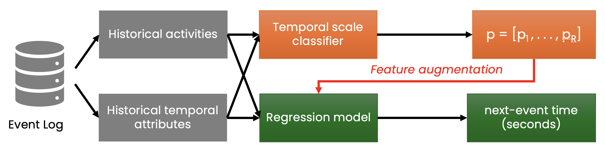

# T-Boost: Temporal Boosting for Next-Event Time Prediction

T-Boost is a lightweight predictive process monitoring pipeline for **next-event time prediction** on event logs.

The core idea is simple: real-world event logs often contain highly heterogeneous waiting times, ranging from seconds to days or months. Instead of forcing one regression model to learn all temporal scales blindly, T-Boost first estimates the likely **temporal scale** of the next event and then uses these soft temporal-scale probabilities as additional features for regression.

In short:

<p align="center">
  
</p>

<p align="center">
  <em>Overview of the T-Boost architecture.</em>
</p>

The repository contains scripts for preprocessing event logs, training temporal-scale classifiers, training next-event time regressors, evaluating models, and generating plots.

---

## Method Overview

T-Boost consists of two main stages.

### 1. Temporal-scale estimation

Given an event prefix, T-Boost predicts a probability distribution over coarse temporal scales.

For example, the next event may belong to one of several time regimes:

```text
r1: short delay
r2: medium-short delay
r3: medium-long delay
r4: long delay
```

The classifier does not output only one hard label. Instead, it outputs soft probabilities:

```text
[p(r1), p(r2), p(r3), p(r4)]
```

These probabilities preserve uncertainty between neighboring temporal scales.

### 2. Next-event time regression

The soft temporal-scale probabilities are added as extra features to a regression model. The regressor then predicts the next-event time.

This allows the regression model to adapt its behavior across different temporal scales without requiring a large sequence model such as an LSTM or Transformer.

---

## Repository Structure

```text
T-Boost/
├── scripts/
│   ├── data_preprocess.py
│   ├── data_analysis.py
│   ├── decision_tree_time_regime.py
│   └── mlp.py
├── pyproject.toml
├── uv.lock
└── README.md
```

Expected local working folders:

```text
data/        # raw event logs
data_csv/    # preprocessed CSV files
results/     # trained models, metrics, predictions, and plots
```

These folders may need to be created manually before running experiments.

---

## Requirements

The project requires Python 3.11 or newer.

Main dependencies include:

* pandas
* scikit-learn
* torch
* pm4py
* flwr
* flwr-datasets
* onnxscript
* neutron

The repository includes a `pyproject.toml` and `uv.lock`, so the recommended setup uses `uv`.

---

## Installation

Clone the repository:

```bash
git clone https://github.com/tuhh-ncps/T-Boost.git
cd T-Boost
```

Install dependencies with `uv`:

```bash
uv sync
```

Alternatively, create a virtual environment manually:

```bash
python3.11 -m venv .venv
source .venv/bin/activate
pip install pandas scikit-learn torch pm4py flwr flwr-datasets onnxscript neutron
```

---

## Input Data

Place raw event logs inside the `data/` directory.

Supported input formats depend on the preprocessing script, but the pipeline is designed for process-mining event logs such as:

```text
.xes
.zip
.csv
```

Example:

```text
data/
├── BPI12.xes
├── helpdesk.xes
└── BPI20.zip
```

---

## Recommended Pipeline

A typical full run follows this order:

```bash
python scripts/data_preprocess.py \
  --data-dir data \
  --output-dir data_csv
```

```bash
python scripts/decision_tree_time_regime.py \
  --data-dir data_csv \
  --train-file bpi_12_w_train.csv \
  --test-file bpi_12_w_test.csv
```

```bash
python scripts/mlp.py \
  --data-dir data_csv \
  --train-file helpdesk_train_with_time_regime.csv \
  --test-file helpdesk_test_with_time_regime.csv
```

```bash
python scripts/data_analysis.py \
  --data-dir data \
  --output-dir results/data_analysis
```

---

## Scripts

### `scripts/data_preprocess.py`

Converts raw event logs into enriched CSV files for training and testing.

Example:

```bash
python scripts/data_preprocess.py \
  --data-dir data \
  --output-dir data_csv
```

Common options:

```text
--data-dir      Input directory containing raw event logs
--output-dir    Output directory for generated CSV files
--time-unit     Time unit: seconds, minutes, hours, or days
--time-bucket   Optional rounding bucket for temporal features
--dataset       Process only one dataset file
--test-size     Fraction used for the test split
```

Outputs:

```text
data_csv/
├── <dataset>_train.csv
└── <dataset>_test.csv
```

The generated CSV files include prefix-based features, next-event time targets, next-activity targets, and temporal-regime labels.

---

### `scripts/decision_tree_time_regime.py`

Trains the temporal-scale classifier.

Example:

```bash
python scripts/decision_tree_time_regime.py \
  --data-dir data_csv \
  --train-file bpi_12_w_train.csv \
  --test-file bpi_12_w_test.csv
```

Input:

```text
data_csv/
```

Output:

```text
results/decision_tree_time_regime/
├── models/
├── metrics/
└── training artifacts
```

The trained classifier predicts temporal regimes and produces soft temporal-scale probabilities that can be used by downstream regressors.

---

### `scripts/mlp.py`

Trains a PyTorch MLP regressor for next-event time prediction.

Example:

```bash
python scripts/mlp.py \
  --data-dir data_csv \
  --train-file helpdesk_train_with_time_regime.csv \
  --test-file helpdesk_test_with_time_regime.csv
```

The MLP expects the input CSV files to contain soft temporal-regime probability columns:

```text
predicted_time_regime_q1_pct
predicted_time_regime_q2_pct
predicted_time_regime_q3_pct
```

Output:

```text
results/mlp/
├── models/
├── predictions/
└── mlp_metrics_all.csv
```

---

### `scripts/data_analysis.py`

Runs exploratory process-mining analysis on raw `.xes` logs.

Example:

```bash
python scripts/data_analysis.py \
  --data-dir data \
  --output-dir results/data_analysis
```

Outputs per dataset may include:

```text
directly-follows graph PDF
last-activity summary CSV
sequence-length plots
execution-time plots
variant Pareto plot
trace-vs-timespan scatter plot
label mapping CSV
```

This script processes all `.xes` files in the input directory.

---

## Outputs

Depending on the executed scripts, outputs are written under `results/`.

Typical outputs include:

```text
results/
├── decision_tree_time_regime/
│   ├── models/
│   ├── metrics/
│   └── confusion matrices
├── mlp/
│   ├── models/
│   ├── predictions/
│   └── mlp_metrics_all.csv
└── data_analysis/
    ├── directly-follows graphs
    ├── activity summaries
    └── exploratory plots
```

---

## Reproducibility

For reproducible experiments, keep the following fixed:

* dataset preprocessing
* train/test split
* temporal-scale construction
* model hyperparameters
* random seeds
* evaluation metric definitions

The recommended structure is:

```text
raw event logs → preprocessed CSV files → temporal-scale probabilities → regression model → metrics and plots
```

---

## Citation

If you use this repository, please cite the corresponding paper:

```bibtex
@inproceedings{tran2026tboost,
  title     = {T-Boost: Temporal Boosting for Next Event Time Prediction},
  author    = {Tran, Trinh and Landsiedel, Olaf},
  booktitle = {AI4BPM 2026},
  year      = {2026}
}
```

---

## License

This project is proprietary. A `LICENSE` file is included in the repository root that describes the terms under which the software may be used.
